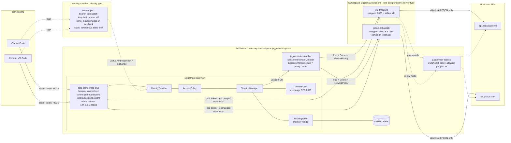

# Architecture

One MCP endpoint per developer; behind it, one isolated pod per (user, server type). The gateway,
router, controller and admin listener depend only on `internal/core/contracts`; every pluggable
piece (identity, policy, token broker, provisioner, routing table, egress enforcer, directory,
audit sink) is an adapter chosen by a `type:` in `juggernaut.yaml`. This mirrors cerebro's
contracts / adapters / registry design; `docs/DESIGN.md` is the full design record.

## System

**Reading it**

- The gateway is the only thing agents talk to. The identity adapter resolves every request to a
  `Principal` (subject, kind, groups, token scopes); the policy adapter turns it into `Grants`
  (server types, admin, caps, tool visibility). Handlers and the router consult grants, never
  headers or tokens.
- Dashed-out identity: with `bearer_*` types the IdP mints tokens and the gateway validates them;
  with `none` and `static` there is no IdP, nothing to discover, and the network is the protection
  ([IDENTITY.md](IDENTITY.md)).
- The `SessionManager` is the gateway's use case: caps, cold-start hold, one pod per (user, server
  type). It asks the `Provisioner` for pods and never knows whether that is a docker container on
  a laptop or a `Session` object a controller turns into a Pod.
- The controller owns everything that touches the cluster: pod spec, per-session `Secret`, and
  the objects the `EgressEnforcer` renders. Which enforcer runs is `network.egressEnforcer`
  ([ACCESS-CONTROL.md](ACCESS-CONTROL.md)).
- Every hop from the gateway to a pod carries the per-pod secret and the per-user downstream token
  the broker minted; the client's own token never leaves the gateway.

## Contracts

`internal/core/contracts` is the whole dependency surface of the gateway, router, controller and
admin listener. One file per kind; an adapter implements exactly one and registers itself with
`internal/core/registry` in `init()`.

| File | Contract | Verbs | Selector | Adapters |
|---|---|---|---|---|
| `identity.go` | `IdentityProvider` | `Resolve(req) → Principal`, `Challenge()`, `ProtectedResourceMetadata()` | `identity.type` | `none`, `static`, `bearer_jwt`, `bearer_introspect` |
| `policy.go` | `AccessPolicy` | `Grants(principal, client) → Grants`, `ToolRule(grants, server, tool)` | `authorization.type` | `groups` |
| `broker.go` | `TokenBroker` | `TokenFor(principal, server) → Token`, `Revoke(subject)` | `identity.broker.mode` | `exchange`, `none`, `refresh-token` |
| `provision.go` | `Provisioner` | `Ensure(spec)`, `Status(key)`, `Release(key)`, `List()`, `Logs(key)` | `gateway.runtime.kind` | `local`, `kube` |
| `routing.go` | `RoutingTable` | pods, MCP sessions, `Touch`, `LastActive`, `InFlight` | `gateway.routing.type` | `memory`, `redis` |
| `isolation.go` | `EgressEnforcer` | `Validate(st)`, `Objects(sess, st)`, `OnReady`, `OnCleanup`, `NamespaceObjects`, `PodEnv` | `network.egressEnforcer` | `cilium`, `proxy`, `none` |
| `directory.go` | `Directory` | users, groups, sessions, password reset, logout | `identity.keycloakAdmin` | `keycloak` |
| `audit.go` | `AuditSink` | `Write(record)`, `Close()` | `gateway.audit.sink` | `stdout`, `file` |
| `sessions.go` | `SessionManager` | `EnsurePod`, `Release`, `ReleaseAll`, `SessionsFor` | (not an adapter: `gateway.Manager`) | |

Every adapter is constructed with a `core.Context`: the live config store, a `Secrets` source
(never values from the file), a logger, its own `options:` map, and a Kubernetes connection when
the process runs in a cluster.

## Wire contract of a session pod

Whatever image a server type uses, the pod the provisioner runs must satisfy one wire contract,
which the in-house `juggernaut-wrapper` provides for stdio servers and fronts for HTTP servers:

| Endpoint | Port | Who calls it | Rule |
|---|---|---|---|
| `POST /mcp` (Streamable HTTP), `GET /mcp` (SSE), `DELETE /mcp` | 9000 | gateway only | requires `X-Juggernaut-Pod-Token`; per-user token arrives as `Authorization` and is placed per the server's token mode |
| `GET /readyz` | 9001 | kubelet, gateway | 200 once the wrapper listens and the pod token is loaded |
| `GET /healthz` | 9001 | kubelet | 503 once the child restart budget is exhausted |

The wrapper makes no outbound connections of its own; only the child does, under the pod's policy.

## Contract tests

`internal/core/contracts/contracttest` is the harness: one function per contract that checks the
shape and the invariants every implementation must keep (`IdentityProvider`, `AccessPolicy`,
`RoutingTable`, `TokenBroker`, `AuditSink`, `Provisioner`). Every adapter's test calls the function
for its kind; adapter-specific behaviour gets its own tests next to it. `bearer_jwt` runs against
a mocked issuer (discovery, JWKS, RS256 signing); `redis` and `kube` need a live service and are
covered by the kind demos in `docs/MILESTONE-*.md`.

## Adding an adapter

1. Create `internal/adapters/<kind>/<type>/adapter.go` with `const Type`, a
   `New(*core.Context)` constructor returning the contract, and
   `func init() { registry.<Kind>.Register(Type, New) }`.
2. Read your configuration from `ctx.Cfg()` and `ctx.Options`; read secrets through `ctx.Secrets`.
3. Add a test that calls the harness for your kind.
4. Add the blank import to `internal/adapters/all/all.go`. `juggernaut adapters` lists what a
   binary can build.

Go links statically, so unlike cerebro's `module:Class` lookup the set of adapters is fixed at
build time; an out-of-tree adapter is a package a custom `main` imports.
