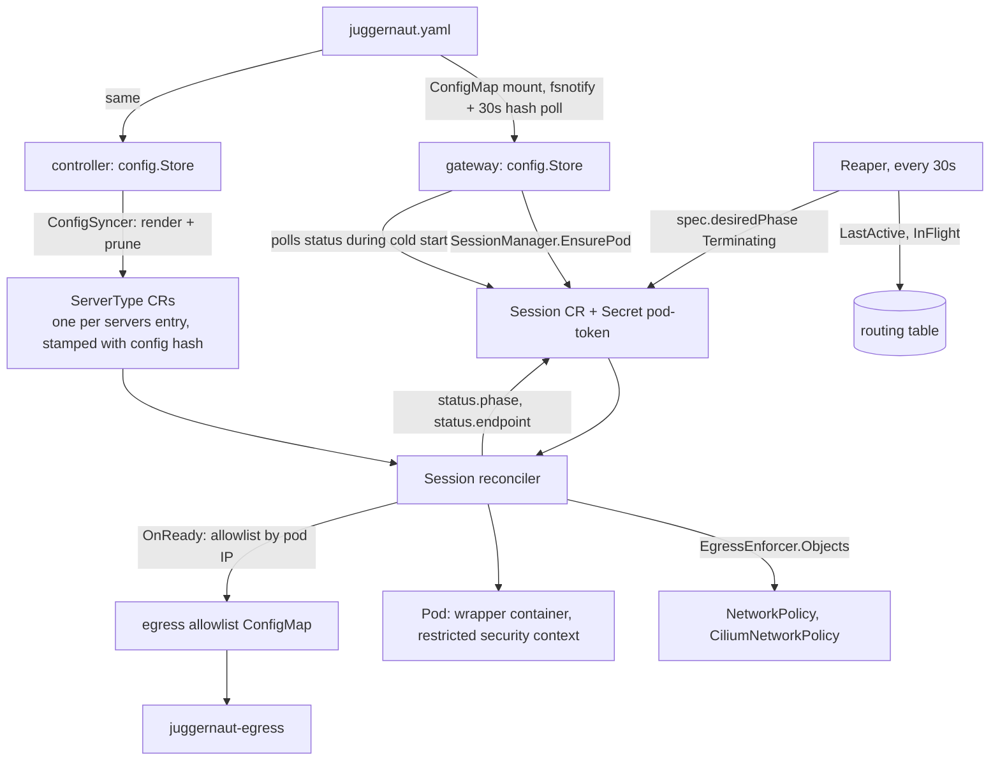
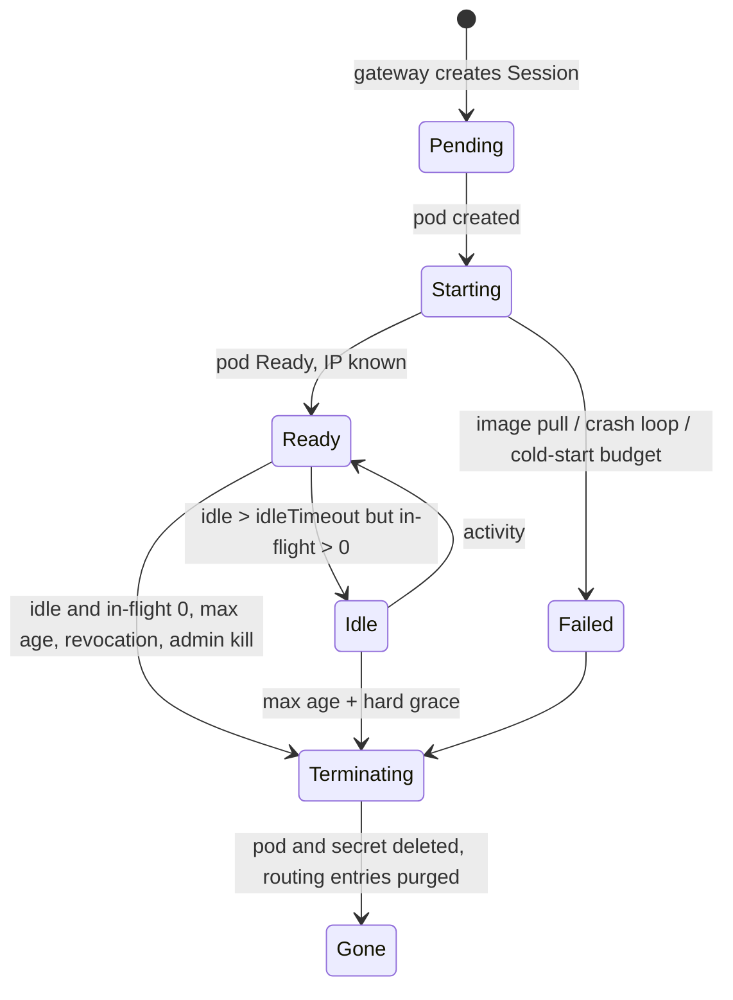

# Architecture

Juggernaut is a self-hosted, Kubernetes-native MCP gateway. One MCP endpoint per developer; behind
it, one isolated pod per (user, server type), created on first use and torn down when idle, each
running with a token that names the calling user. This document describes how the system is put
together: the processes, the two paths through them (request and control), the session lifecycle,
the data each piece owns, how configuration and isolation reach the cluster, and how the code is
layered. [IDENTITY.md](IDENTITY.md), [ACCESS-CONTROL.md](ACCESS-CONTROL.md) and
[CONNECT.md](CONNECT.md) go deeper on their topics; [DESIGN.md](DESIGN.md) is the design record
with the alternatives that were rejected.

## 1. Processes

| Process | Binary / image | Listens on | Talks to | State it owns |
|---|---|---|---|---|
| Gateway | `juggernaut-gateway` | `:8080` data + control plane, `127.0.0.1:24680` admin, `:9090` metrics | IdP (JWKS, exchange, introspection), routing table, provisioner (Kubernetes API or local docker), session pods | none durable; routing state lives in the routing table |
| Controller | `juggernaut-controller` | `:8081` probes, `:9091` metrics | Kubernetes API, routing table (read: activity) | `ServerType` and `Session` objects, pods, per-pod secrets, network policies, the egress allowlist ConfigMap |
| Wrapper | `juggernaut-wrapper` (in every session pod) | `:9000` MCP (gateway only), `:9001` probes | its child process; upstream APIs (the child, under the pod's policy) | the child process and its upstream MCP session |
| Egress proxy | `juggernaut-egress` (optional, `network.egressEnforcer: proxy`) | `:3128` CONNECT | upstream APIs; the allowlist ConfigMap (read) | nothing |
| Routing store | Valkey / Redis (bundled or yours) | `:6379` | | sessions, pods, activity, in-flight counters, sealed pod tokens |
| Identity provider | Keycloak (bundled for laptops) or your IdP | | | users, groups, tokens |
| Admin UI | static assets embedded in the gateway | the admin listener | Keycloak Admin REST through the gateway | none |
| CLI | `juggernaut` | | | validate, render, schema, adapters, admin login |

Two namespaces on Kubernetes: `juggernaut-system` (gateway, controller, egress, store, optional
Keycloak) and `juggernaut-sessions` (session pods, under Pod Security Admission `restricted` and a
namespace-wide default-deny NetworkPolicy). On a laptop the gateway alone, with the `local`
provisioner, runs session "pods" as docker containers; there is no controller.

## 2. Request path

```mermaid
sequenceDiagram
  autonumber
  participant C as MCP client
  participant G as Gateway
  participant I as IdP
  participant T as Routing table
  participant K as Controller / Kubernetes
  participant P as Session pod (wrapper + server)
  participant U as Upstream API

  C->>G: POST /adapters/jira/mcp  (Bearer at, Mcp-Session-Id?)
  G->>G: IdentityProvider.Resolve → Principal; AccessPolicy.Grants → Grants
  G->>T: GetPod(user, jira)
  alt no pod
    G->>T: caps check, PutPod(Pending, pod token)
    G->>K: Provisioner.Ensure → Session CR + Secret(pod token)
    K->>K: reconcile: NetworkPolicy, Pod
    loop hold ≤ coldStartBudget
      G->>K: Provisioner.Status
    end
    G->>T: PutPod(Ready, endpoint)
  end
  G->>I: TokenBroker.TokenFor (RFC 8693 exchange, cached)
  G->>P: POST http://podIP:9000/mcp  X-Juggernaut-Pod-Token, Authorization: Bearer dt, Mcp-Session-Id (upstream)
  P->>U: tool call with dt (header / env / file per token mode)
  U-->>P: result
  P-->>G: result
  G-->>C: result, Mcp-Session-Id (gateway-issued)
  G->>T: Touch, InFlight−1; audit record; metrics
```

What each hop enforces:

| Hop | Check | Where |
|---|---|---|
| 1 | bearer present, valid (or the identity type's own rule), scope `juggernaut:mcp` | `gateway.Authn`, identity adapter |
| 2 | groups → server types; caps; tool visibility | policy adapter, `gateway.Manager` |
| 3 | the session id belongs to this subject and this pod | `gateway` data-plane handler |
| 4 | pod accepts only the gateway (NetworkPolicy ingress) and only with its own secret | controller-rendered policy, wrapper |
| 5 | the pod reaches only its allowlisted hosts | `EgressEnforcer` adapter (Cilium policy or egress proxy) |
| 6 | the upstream sees a token whose `sub` is the user and whose audience is that server type | token broker |

The client's own access token stops at hop 1. The exchanged token is minted per (token, server
type), cached until shortly before expiry, and never outlives the token it came from.

The aggregated `/mcp` endpoint follows the same path per adapter: the router builds one MCP server
per client session, lists tools from each granted adapter's pod (cached per config version), and
forwards each call to the caller's own pod for that adapter. Lazy mode replaces the tool list with
`search_tools`, `describe_tool`, `execute`; `whoami` is always present ([CONNECT.md](CONNECT.md)).

## 3. Control path



- **Configuration is the source of truth**; CRs are derived. The controller renders every
  `servers[]` entry into a `ServerType` with the config hash and removes entries that disappeared.
  Running sessions keep referencing the hash they were created under and age out; a config change
  never mutates a live pod.
- **Sessions are runtime state**, created by the gateway and reconciled by the controller. The
  gateway needs RBAC only to create/read/delete `Session` objects and create the per-pod Secret;
  it never touches Pods.
- **Isolation is rendered before the pod exists**, owned by the `Session` through owner
  references, so deleting the Session garbage-collects everything.
- **The reaper** runs inside the controller and reads activity the gateway wrote to the routing
  table; it sets `desiredPhase: Terminating`, and the reconciler does the deletion.

## 4. Session lifecycle

Three things are called "session"; they relate like this:

| Term | Owner | Cardinality | Lifetime |
|---|---|---|---|
| user identity (`sub`) | IdP | 1 per person | forever |
| session pod (`Session` CR, pod `<serverType>-<userHash8>`) | controller | 1 per (user, server type) | first use → idle timeout / max age |
| MCP session (`Mcp-Session-Id: jg_<26 chars>`) | gateway | N per pod (one per client) | `initialize` → `DELETE /mcp` or pod gone |



| Rule | Value | Where |
|---|---|---|
| cold-start hold | `gateway.coldStartBudget`, default 60s, max 180s; then `503` + `Retry-After` | `gateway.Manager` |
| readiness | wrapper `/readyz` (kubelet probe every 1s) | wrapper, pod spec |
| idle | no request for `idleTimeout` (default 15m, per server override) and in-flight = 0 | reaper |
| in-flight | incremented per forwarded request and per streamed call; key expires after 1h so a crashed gateway cannot pin a pod | routing table |
| max age | `maxSessionAge` (default 12h) with in-flight 0; hard stop at max age + 15m | reaper |
| caps | per user (`caps.podsPerUser`, group override), per type (`servers[].maxPods`), total (`caps.totalPods`) | gateway before create, controller on reconcile |
| re-spawn | the old MCP session id answers `404`; the client re-initializes (spec behaviour), which cold-starts a new pod | data plane |

## 5. Data model

**Routing table** (`RoutingTable` contract; `memory` for a single process, `redis` shared by
every gateway replica, with a memory cache tier in front):

| Key | Value | TTL |
|---|---|---|
| `jg:sess:<mcpSessionId>` | subject, server type, pod, upstream session id, client, protocol version, lazy | `maxSessionAge` |
| `jg:sess:by-pod:<pod>` | set of MCP session ids | `maxSessionAge` |
| `jg:pod:<serverType>:<userHash>` | pod name, endpoint, phase, created, config hash | none |
| `jg:podtok:<pod>` | pod token, AES-GCM sealed with `JUGGERNAUT_KEK` | none |
| `jg:pods:by-user:<subject>`, `jg:pods:all` | index sets | none |
| `jg:active:<pod>` | last request time | none |
| `jg:inflight:<pod>` | counter | 1h, refreshed |

Losing the store loses MCP session ids (clients re-initialize) but not pods: the controller's
objects are the source of truth for what runs, and the reaper treats pods without activity records
as idle from their ready time.

**Kubernetes objects** (`juggernaut.io/v1alpha1`, internal; operators never edit them):

| Object | Spec | Status |
|---|---|---|
| `ServerType` | the defaulted `servers[]` entry: image, transport, command, ports, token mode, egress, resources, runtime class, idle/max age, security, rendered wrapper config | active pods |
| `Session` | subject, user hash, server type, config hash, pod-token Secret name, desired phase | phase, pod name, pod IP, endpoint, message, started/ready/expires |

Per session the controller also owns a `Pod`, the `Secret <session>-pod-token`, the
`ConfigMap <serverType>-wrapper` (shared per type), and the enforcer's objects. Labels
`juggernaut.io/session-id`, `server-type`, `user-hash`, `config-hash` tie them together.

**Secrets**: the per-user token exists only in gateway memory, the exchange cache, the request to
the pod, and (for `env`/`file` modes) the child's environment or a tmpfs file. It is never in a
Kubernetes object, a log line (the wrapper scrubs its child's stderr), or an API response. The
per-pod secret is the one Secret object, mounted read-only into its pod.

## 6. Configuration flow

One file, `juggernaut.yaml`, validated against `schemas/juggernaut.schema.json` and then by
semantic rules (`juggernaut validate`). Secrets are references (`{env: NAME}`, `{file: PATH}`);
`${NAME}` and `${NAME:-default}` in strings are interpolated from the environment at load.

| Section | Selects | Consumed by |
|---|---|---|
| `identity` | identity adapter (`type`), broker (`broker.mode`), directory (`keycloakAdmin`) | gateway |
| `gateway` | listeners, provisioner (`runtime.kind`), routing (`routing.type`), audit (`audit.sink`), caps, timeouts, lazy-tool policy, telemetry | gateway; controller reads routing and timeouts |
| `network` | egress enforcer (`egressEnforcer`), sessions namespace, pod auth, deny CIDRs, image policy | controller |
| `servers[]` | server types: rendered into `ServerType` CRs and the wrapper config | controller, gateway (grants, tool rules) |
| `authorization` | policy adapter (`type`) and its group table | gateway |

Both binaries watch the mounted file and swap the parsed config atomically on a valid reload; a
rejected reload keeps the previous config live and increments `juggernaut_config_reload_errors_total`.

## 7. Isolation

Each session pod is built to be treated as compromised without consequence for anyone else
([ACCESS-CONTROL.md](ACCESS-CONTROL.md) has the threat table):

| Layer | Mechanism |
|---|---|
| process | non-root, read-only rootfs, all capabilities dropped, seccomp RuntimeDefault, no service-account token, no service links, optional `runtimeClassName` (gVisor, Kata) |
| ingress | NetworkPolicy admits only gateway pods on 9000/9001; wrapper requires the per-pod secret (constant-time compare) |
| egress `cilium` | baseline NetworkPolicy (DNS + declared ports, private/link-local/metadata/API CIDRs excluded) plus `CiliumNetworkPolicy` with `toFQDNs` and DNS-proxy rules limited to the declared names |
| egress `proxy` | NetworkPolicy to `juggernaut-egress` only; `dnsPolicy: None` with no nameservers; the proxy accepts CONNECT for (pod IP, host, port) in the allowlist the controller publishes, resolves names itself and refuses results in denied CIDRs |
| egress `none` | laptops only (`allowInsecure`); metadata and API server still denied |
| credentials | audience-scoped exchanged token; user-supplied secrets sealed on the user's machine ([SECURITY.md](SECURITY.md)); the pod cannot reach the IdP, the gateway, the store or other pods |
| transport | `podAuth: mtls`: gateway and pod verify each other's controller-issued certificates by SPIFFE identity |

## 8. Observability

| Signal | Source | Content |
|---|---|---|
| audit log (JSON lines, `stdout` or `file` sink) | gateway | `tool_call` (subject, server type, pod, session, tool, upstream tool, redacted arguments, duration, outcome), `adapter_request`, `admin_action` |
| Prometheus `:9090` (gateway), `:9091` (controller) | `internal/telemetry` | `juggernaut_pods_active`, `cold_start_seconds`, `idle_terminations_total`, `auth_failures_total{reason}`, `tool_calls_total{server_type,outcome}`, `tool_call_seconds`, `config_reload_errors_total`, `egress_decisions_total` |
| OpenTelemetry traces | OTLP/HTTP when `gateway.telemetry.otlpEndpoint` is set | request spans through the gateway |
| control plane API | gateway | `/adapters/{name}/status` (pods by phase), `/sessions`, `/users/{sub}/sessions` |
| Kubernetes | controller | `kubectl get sessions,servertypes` with phase columns; events on failures |

Argument redaction happens in `audit.Logger` before any sink sees a record: values under keys
matching the redaction list, bearer-looking strings and JWT-shaped strings are replaced.

## 9. Deployment topologies

| Topology | Identity | Provisioner | Routing | Egress | Files |
|---|---|---|---|---|---|
| one machine, no IdP | `none` | `local` (docker) | `memory` | `none` | `examples/juggernaut.laptop.yaml` |
| laptop with Keycloak (milestone 0) | `bearer_jwt` + `exchange` | `local` | `memory` | `none` | `deploy/compose` |
| kind without Cilium | `bearer_jwt` | `kube` | `redis` | `proxy` | `deploy/kustomize/overlays/kind` |
| kind with Cilium | `bearer_jwt` | `kube` | `redis` | `cilium` | `deploy/kustomize/overlays/kind-cilium` |
| managed cluster | `bearer_jwt` / `bearer_introspect`, your IdP | `kube` | `redis` (external or bundled) | `cilium` or `proxy` | `charts/juggernaut` |

The core has no cloud dependency; cloud secret stores or image signature verification are optional
plugins.

## 10. Scaling and failure behaviour

| Concern | Behaviour |
|---|---|
| gateway replicas | stateless; any replica serves any session because routing is in the shared store and the gateway → pod hop is direct pod IP; no client affinity needed |
| gateway restart | in-memory tiers are cold; the store is authoritative; clients keep their session ids |
| store loss | session ids gone (clients re-initialize); pods and their tokens are rebuilt from Session objects on the next request path |
| controller restart | reconciles from the API; leader election for more than one replica |
| pod crash | wrapper restarts the child with backoff (5 in 10 min, then `/healthz` fails and the pod restarts); MCP sessions on it become invalid → clients re-initialize |
| pod eviction / node loss | reconciler marks the Session Failed; the next request creates a new pod |
| IdP unreachable | new logins fail; existing JWTs validate until expiry; `bearer_introspect` fails open by default and logs |
| exchange endpoint unreachable | adapter requests fail with `502` and an audit `error` outcome; cached downstream tokens keep working until they near expiry |
| config reload with errors | previous config stays live; metric and log line |
| 1,000 users × 5 types | up to 5,000 pods in one namespace, each with its own policy objects; caps bound it; the shared namespace avoids per-user RBAC/quota objects |

## 11. Code layering

```
internal/core             Principal, Grants, ids, Sealer, Context, Secrets          depends on config
internal/core/contracts   one interface per adapter kind + SessionManager             depends on core
internal/core/registry    typed registries, populated by adapter init()               depends on contracts
internal/adapters/<kind>/<type>   one implementation per package                      depends on contracts
internal/gateway, router, controller, admin, audit    consumers                        depend on contracts only
internal/app              GatewayFromConfig, ControllerFromConfig (composition roots) the only importer of adapters
cmd/*                     flags, logging, signals; blank-import internal/adapters/all
```

| Kind | Contract | Selector | Adapters |
|---|---|---|---|
| identity | `IdentityProvider`: `Resolve`, `Challenge`, `ProtectedResourceMetadata` | `identity.type` | `none`, `static`, `bearer_jwt`, `bearer_introspect` |
| policy | `AccessPolicy`: `Grants`, `ToolRule` | `authorization.type` | `groups` |
| broker | `TokenBroker`: `TokenFor`, `Revoke` | `identity.broker.mode` | `exchange`, `none`, `refresh-token` |
| provision | `Provisioner`: `Ensure`, `Status`, `Release`, `List`, `Logs` | `gateway.runtime.kind` | `local`, `kube` |
| routing | `RoutingTable`: pods, sessions, `Touch`, `LastActive`, `InFlight` | `gateway.routing.type` | `memory`, `redis` |
| egress | `EgressEnforcer`: `Validate`, `Objects`, `OnReady`, `OnCleanup`, `NamespaceObjects`, `PodEnv` | `network.egressEnforcer` | `cilium`, `proxy`, `none` |
| directory | `Directory`: users, groups, sessions, credentials | `identity.keycloakAdmin` | `keycloak` |
| audit | `AuditSink`: `Write`, `Close` | `gateway.audit.sink` | `stdout`, `file` |

`SessionManager` is the gateway's own use case (`gateway.Manager`), not an adapter; the data
plane, the router and the admin listener consume it through the contract.

Every adapter is built with a `core.Context` (config store, `Secrets`, logger, its `options:` map,
and a Kubernetes connection inside a cluster) and must pass the harness in
`internal/core/contracts/contracttest`. Adding one is a new package that registers itself in
`init()` plus a blank import in `internal/adapters/all`; no existing package changes.

### Wire contract of a session pod

| Endpoint | Port | Rule |
|---|---|---|
| `POST` / `GET` / `DELETE /mcp` (Streamable HTTP) | 9000 | gateway only; requires `X-Juggernaut-Pod-Token`; the per-user token arrives as `Authorization` and is placed per the server's token mode |
| `GET /readyz` | 9001 | 200 once the wrapper listens and the pod token is loaded |
| `GET /healthz` | 9001 | 503 once the child restart budget is exhausted |

The wrapper provides this for stdio servers (it owns the child process and multiplexes the
gateway's sessions onto its one upstream MCP session) and fronts it for HTTP servers (the server
binds to loopback; the wrapper is the only listener). It makes no outbound connections of its own.

### Differences from cerebro

The layering is cerebro's. What is intentionally different: no `Locator` (pods are addressed by
the endpoint the provisioner reports), no `units()`/`jobs()` on adapters (server types are data in
`servers[]`), no `AuthorizationServer` seeding contract (Keycloak setup is the realm export), and a
build-time adapter set instead of import-by-name, because Go links statically.
