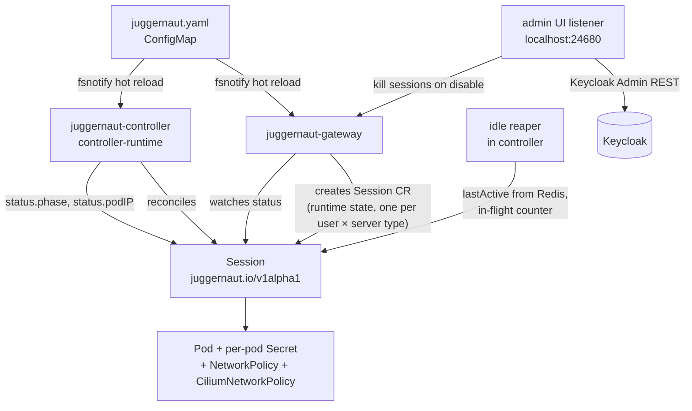
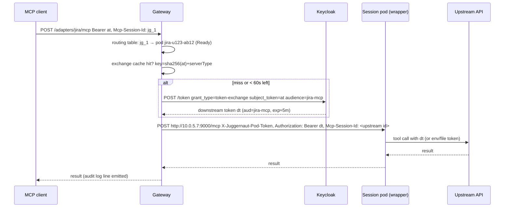
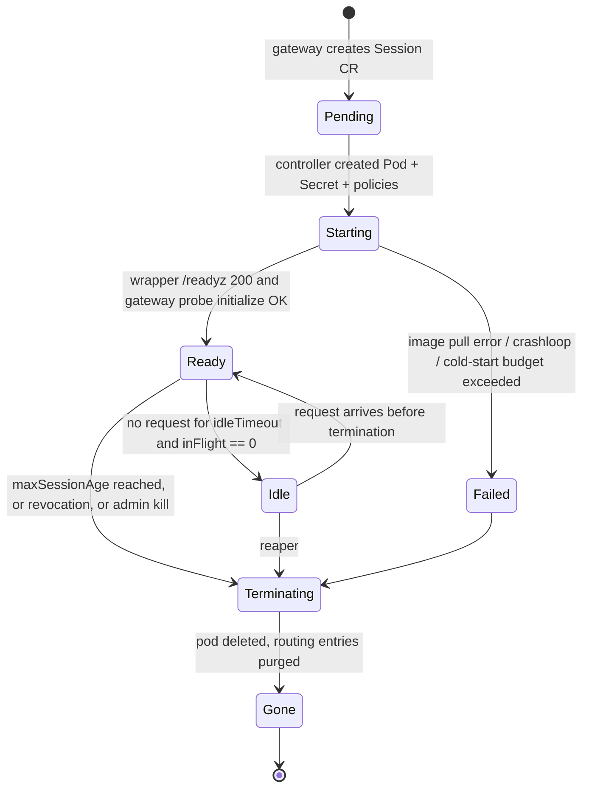

# Juggernaut — System Design

Juggernaut is a **self-hosted**, open-source, Kubernetes-native MCP gateway that runs one isolated
MCP server pod per (user, server type), brokers OAuth 2.0 on the front door, and hands each pod a
token that identifies the calling user.

This document is the design deliverable for the brief in `docs/DESIGN-BRIEF.md`. Sections follow
the order the brief asks for. Manifests and schemas live next to the code they describe; this file
links to them rather than duplicating them.

---

## 1. Assumptions and open questions

### Assumptions

| # | Assumption |
|---|------------|
| A1 | **Self-hosting is the primary deployment model.** The operator owns the cluster (laptop kind/k3s/OrbStack, or a managed cluster they administer) and the IdP. Nothing in the core may require a cloud vendor service. |
| A2 | Keycloak 26.x is the reference IdP. Any OIDC provider that publishes discovery + JWKS works for token validation; only **token exchange** (RFC 8693) and the **admin UI** depend on Keycloak-specific features, and both are behind adapter interfaces. |
| A3 | The cluster runs Kubernetes ≥ 1.29 (Pod Security Admission GA, `NetworkPolicy` v1, `RuntimeClass` GA, `sidecarContainers` on by default from 1.29). |
| A4 | Scale target for the design is 1,000 users × 5 server types = up to 5,000 session pods, but a laptop must run the whole stack with 1 user and 2 server types. |
| A5 | MCP protocol revision **2025-06-18** (Streamable HTTP, `Mcp-Session-Id`, OAuth protected-resource metadata, `MCP-Protocol-Version` header). Legacy HTTP+SSE is supported for *upstream* servers only; clients must speak Streamable HTTP. |
| A6 | Upstream APIs a session pod calls (Jira, GitHub, …) accept the exchanged token or a per-user secret the user has stored; Juggernaut does not implement per-API credential brokering beyond the token modes in §3. |
| A7 | Redis (or Valkey) is available or bundled. It is the only stateful dependency of the gateway; the controller's state is the Kubernetes API. |
| A8 | The project licence is not chosen yet (the brief requires Apache-2.0 or MIT). Every runtime dependency is Apache-2.0, MIT, BSD, or MPL-2.0 so either choice works. |

### Open questions (to confirm with the operator)

1. Should a user's pod for a server type be **reused across MCP clients** on the same machine (Claude Code and Cursor share one Jira pod), or be one pod per client? Design default: **one pod per (user, server type)**, shared by all of that user's clients; clients get distinct MCP session ids on the same pod.
2. Is a per-tenant (group) namespace split needed for chargeback/quota, or is a single sessions namespace with quotas by label enough? Design default: single namespace, opt-in per-group namespaces.
3. Do stdio servers that only read the token from an environment variable need seamless rotation, or is "restart the child at the next idle moment" acceptable? Design default: restart at idle boundary.

---

## 2. Architecture overview

### What is kept from cerebro, what is dropped

| cerebro concept | Juggernaut | Why |
|-----------------|------------|-----|
| One MCP endpoint per developer, identity resolved at the gateway to a `Principal`, converted to `Grants`, checked on every tool call | **Kept** (`Principal` → `Grants` in `internal/authz`) | It is the right shape; it just moves from Python/FastMCP to Go. |
| `scopes:` in `cerebro.yaml` mapping IdP groups → resources | **Kept as `authorization.groups[]` → server types + tool visibility** | "Scope" in cerebro is an index partition. Juggernaut has no indexes, so the word is only used for OAuth scopes to avoid confusion. |
| `401` + `WWW-Authenticate: Bearer resource_metadata=…` challenge | **Kept**, extended to the full 2025-06-18 PRM document | Already spec-aligned. |
| `identity.mode: trusted_headers` (`X-Forwarded-User`, SSO proxy shim) | **Dropped** | The brief requires a real OAuth 2.0 resource server. A header-trusting mode is one misrouted request away from impersonation. |
| Long-lived shared upstream units (`mcp-confluence` via `mcp-atlassian`, code units via a stdio bridge) | **Dropped**; replaced by ephemeral per-user pods | Shared units force a shared upstream identity. |
| `cerebro/bridge/` stdio-to-HTTP bridge inside images | **Kept in spirit** as the in-house `juggernaut-wrapper` (§8) | Same job, but with token modes, readiness and per-pod auth. |
| Provisioner contract (`ensure()`, `release()`, `touch()`, `endpoint()`) and the kopf idle operator | **Kept as an interface** (`internal/runtime.Backend`) with `local` and `kube` implementations; the idle operator becomes the reaper (§4) | Lets milestone 0 run without Kubernetes. |
| Adapter registry (`cerebro.adapters.<kind>.<type>:Adapter`) | **Dropped** | Juggernaut has three pluggable seams (IdP, token broker, egress enforcer); Go interfaces are enough. |
| Service credentials injected by the gateway (`LIGHTRAG_API_KEY`) | **Dropped** | The whole point is per-user credentials. |

### Request path

```mermaid
flowchart LR
  C[MCP client<br/>Claude Code / Cursor / VS Code] -- "Bearer at, Mcp-Session-Id" --> GW
  subgraph Gateway pod(s) - namespace juggernaut-system
    GW[juggernaut-gateway<br/>HTTP :8080 data+control plane]
    AUTH[authn: JWKS validate<br/>authz: groups → grants]
    BROKER[token broker<br/>RFC 8693 exchange cache]
    RT[routing table<br/>in-mem LRU + Redis]
    GW --> AUTH --> BROKER --> RT
  end
  RT -- "no pod: create Session CR, hold ≤ cold-start budget" --> K8S[(Kubernetes API)]
  RT -- "pod ready: POST http://podIP:9000/mcp<br/>X-Juggernaut-Pod-Token, Authorization: exchanged token" --> POD
  subgraph Session pod - namespace juggernaut-sessions
    POD[juggernaut-wrapper :9000<br/>readiness :9001]
    CHILD[stdio MCP server child process<br/>or HTTP MCP server container]
    POD --> CHILD
  end
  CHILD -- "only allowlisted FQDNs<br/>via CiliumNetworkPolicy or egress proxy" --> UP[Upstream API<br/>Jira / GitHub / internal]
  R[(Redis)] --- RT
```

### Control path



Components, all in this monorepo (§13):

| Component | Binary / image | Role |
|-----------|----------------|------|
| Gateway | `juggernaut-gateway` | OAuth resource server, MCP router, control-plane API, admin listener. Stateless; horizontally scalable. |
| Controller | `juggernaut-controller` | Reconciles `Session` CRs into pods, secrets, and network policies; runs the idle reaper; renders `juggernaut.yaml` into internal `ServerType` CRs. |
| Wrapper | `juggernaut-wrapper` | Entrypoint in every stdio session pod; also the sidecar in HTTP session pods for readiness and per-pod auth. |
| Egress proxy | `juggernaut-egress` | Optional. CONNECT proxy enforcing hostname allowlists on clusters without an FQDN-aware CNI. |
| Admin UI | static assets served by the gateway | Keycloak user administration + session view. |
| Redis / Valkey | bundled or external | Routing table, exchange cache, idle timestamps, audit spool. |
| Keycloak | bundled (optional) or external | IdP for the reference deployment. |

---

## 3. Identity and token flow

### Passthrough mechanism: decision

| Option | Attribution | Blast radius if pod is compromised | Rotation mid-session | IdP support | Verdict |
|--------|-------------|-----------------------------------|----------------------|-------------|---------|
| A. Forward the client's original access token | Correct | **Whole gateway audience**: the pod can call the gateway (and anything else that accepts the token) as the user | Free (client refreshes, gateway forwards) | Any | Rejected: violates least privilege; the token's `aud` is the gateway, so forwarding it is also a spec violation (MCP auth spec forbids passthrough of tokens not issued for the upstream). |
| B. **OAuth token exchange (RFC 8693)**: gateway exchanges the validated token for a token whose `aud`/`scope` is the one upstream this server type needs | Correct (`sub` preserved, `act` claim names the gateway) | Limited to that upstream audience and scope | Free: gateway re-exchanges when the cached downstream token nears expiry; the client keeps refreshing its own token | Keycloak ✅ (standard token exchange, GA in 26.2), Entra ✅ (OBO flow), Okta ✅, Dex ❌ | **Chosen.** |
| C. Gateway stores per-user refresh tokens and mints access tokens itself | Correct | Gateway holds long-lived credentials for every user: a single high-value target | Free | Any | Rejected for the reference design; kept as the `refresh-token` broker plugin for IdPs without exchange (Dex). |

**Chosen: B**, with C available as a plugin and A never allowed. The choice is per server type (`tokenMode`, §6), so a server that needs *no* user token (`none`) or a *static* secret (`static`) is also expressed there.

### How the token reaches the pod

| Delivery | Used for | Notes |
|----------|----------|-------|
| **Injected header per request** (`Authorization: Bearer <exchanged>`) gateway → wrapper → HTTP MCP server | `tokenMode: header` (HTTP servers, and stdio servers whose wrapper child speaks HTTP locally) | Never stored in the pod. Rotation is free. |
| **Env var at child spawn** (wrapper sets `$JUGGERNAUT_TOKEN` and whatever the server expects, e.g. `JIRA_TOKEN`) | `tokenMode: env` (stdio servers that only read env at start) | Wrapper receives the token in the first request's header, spawns the child, and remembers the token's expiry. On rotation the wrapper restarts the child at the next idle boundary (no in-flight call); the gateway re-issues `initialize` transparently. |
| **tmpfs file** (`/run/juggernaut/token`, mode 0400, `emptyDir{medium: Memory}`) rewritten per request | `tokenMode: file` (servers that re-read a credentials file) | Never in an env var, never in a Secret object, never in `kubectl get pod -o yaml`. |
| Mounted Secret | **Not used** for user tokens | A Secret object is visible to anyone with `get secrets` in the namespace and to etcd backups. Only the per-pod gateway→pod shared secret is a Secret (§5). |

### Sequence: first-time login

```mermaid
sequenceDiagram
  participant C as MCP client
  participant G as Gateway
  participant K as Keycloak
  C->>G: POST /mcp (no token)
  G-->>C: 401 WWW-Authenticate: Bearer resource_metadata="https://gw/.well-known/oauth-protected-resource"
  C->>G: GET /.well-known/oauth-protected-resource
  G-->>C: {resource, authorization_servers:[K issuer], scopes_supported, bearer_methods_supported:["header"]}
  C->>K: GET /.well-known/openid-configuration (+ optional dynamic client registration)
  C->>K: Authorization Code + PKCE, resource=https://gw/mcp
  K-->>C: access token (aud=juggernaut-gateway), refresh token
  C->>G: POST /mcp  Authorization: Bearer at  (initialize)
  G->>G: validate: iss, aud, exp, sig via JWKS; groups claim → grants
  G-->>C: initialize result, Mcp-Session-Id: jg_…
```

### Sequence: warm request with exchange



### Sequence: token refresh mid-session

The client's token expires → client refreshes with Keycloak → the next request carries a new `at`. The gateway's exchange cache is keyed by the hash of the *incoming* token, so a new `at` yields a new exchange. For `tokenMode: env` pods, the wrapper compares the token it spawned the child with; if the `sub` matches and the old token is expired, it schedules a child restart at the next idle boundary. In-flight calls always finish with the token they started with.

### Sequence: revocation

| Event | Detection | Effect |
|-------|-----------|--------|
| User logs out / token revoked at IdP | JWT is still cryptographically valid until `exp`. Gateway optionally calls the introspection endpoint every `auth.introspectInterval` (default 60s) per active session. | Session marked `Revoked`, routing entry deleted, pod terminated with a 5s grace. Client gets `401` on next request and re-runs discovery. |
| User disabled in Keycloak via the admin UI | The admin UI calls `DELETE /users/{sub}/sessions` on the gateway *after* the Keycloak call succeeds. | Same as above, immediate. |
| Keycloak session-revocation event (optional) | Keycloak event listener SPI / admin events webhook to `POST /internal/revocations` (mTLS or shared secret). | Same as above, immediate. |
| Downstream token expires during a long tool call | Not interrupted; the exchanged token had ≥ 60s left when injected, and upstreams validate at request start. | Next request re-exchanges. |

### Authorization model

`Principal{sub, preferred_username, groups[], scopes[]}` → `Grants{serverTypes: map[name]ToolVisibility, lazyTools bool, maxPods int}`.

- `authorization.groups[].serverTypes` lists which server types a group may spawn.
- `servers[].tools.expose` (allow/deny lists, prefixes, renames) is applied per server type; `servers[].tools.groups` narrows visibility of individual tools to groups.
- OAuth **scopes** (kept from cerebro): `juggernaut:mcp` is required on every data-plane token; `juggernaut:admin` on control-plane mutations; `juggernaut:users.admin` for the admin UI. Scopes gate *which API*, groups gate *which server types and tools*.

---

## 4. Session and pod lifecycle

### Three things called "session"

| Term | Owner | Lifetime | Cardinality |
|------|-------|----------|-------------|
| **User identity** (`sub`) | IdP | Forever | 1 per person |
| **Session pod** (`Session` CR, name `<serverType>-<userHash8>`) | Controller | Cold start → idle timeout / max age | 1 per (user, server type) |
| **MCP session** (`Mcp-Session-Id: jg_<26 chars>`) | Gateway | Client-initiated `initialize` → `DELETE /mcp` or pod gone | N per session pod (one per client), **each maps to exactly one pod** and to exactly one upstream MCP session id inside that pod |

The gateway issues its own `Mcp-Session-Id` and never exposes the upstream's. For the aggregated `/mcp` router the gateway session fans out to several pods; the mapping is then `jg_id → {serverType → (pod, upstreamSessionId)}`.

### State machine



### Cold start

- The first request holds the HTTP connection while the pod starts (**hold**, not retry): MCP clients treat `initialize` failures as fatal and do not retry uniformly. The hold is bounded by `gateway.coldStartBudget` (default **60s**, per-server-type override, hard max 180s).
- If the budget is exceeded the gateway returns `503` + `Retry-After: 10` and a JSON-RPC error body (`-32000`, "session pod starting") so well-behaved clients can retry; the pod keeps starting.
- Readiness: wrapper serves `GET /readyz` on `:9001` → 200 once (a) the child process is alive (stdio) or the HTTP server answers `initialize` on loopback (http), and (b) the per-pod secret is loaded. Kubernetes `readinessProbe` uses it (period 1s, failure 3), and the gateway additionally probes `initialize` through the wrapper before flipping to Ready.

### Routing table

| Key (Redis) | Value | TTL |
|-------------|-------|-----|
| `jg:sess:<mcpSessionId>` | `{sub, serverType, podName, podIP, upstreamSessionId, createdAt, protocolVersion, lazy:bool}` | `maxSessionAge` |
| `jg:pod:<serverType>:<userHash>` | `{podName, podIP, phase, createdAt}` | none (deleted by reaper) |
| `jg:active:<podName>` | unix seconds of last request | none |
| `jg:inflight:<podName>` | integer, INCR on request start, DECR on end/stream close | 1h safety TTL, refreshed while streaming |
| `jg:xchg:<sha256(at)>:<serverType>` | encrypted downstream token + exp | until `exp - 60s` |

The gateway keeps an in-memory LRU (`hashicorp/golang-lru/v2`) in front of Redis. After a gateway restart, the LRU is cold and Redis is authoritative. If Redis is lost, the controller rebuilds `jg:pod:*` from Pod labels (`juggernaut.io/user-hash`, `juggernaut.io/server-type`); MCP session ids are lost and clients re-`initialize` (they get `404` per spec and do so automatically). Horizontal gateway scaling needs no affinity: any replica can serve any session because state is in Redis, and the gateway → pod hop is direct pod IP.

### Idle reaper

- "Idle" = `now - jg:active:<pod> > idleTimeout` **and** `jg:inflight:<pod> == 0`. Streams (SSE `GET /mcp`, streamed tool results) hold an in-flight count for as long as the connection is open; a heartbeat refreshes the key TTL every 30s so a crashed gateway replica cannot pin a pod forever.
- The reaper runs in the controller every 30s, reads Redis, and sets `spec.desiredPhase: Terminating` on idle Sessions. Deletion uses `terminationGracePeriodSeconds: 30`; the wrapper drains on `SIGTERM`.
- `maxSessionAge` (default 12h) terminates regardless of activity once in-flight is 0; after `maxSessionAge + 15m` it terminates even with in-flight work.
- Per server type: `servers[].idleTimeout`, `servers[].maxSessionAge`.
- Re-spawn experience: the old `Mcp-Session-Id` is gone; the gateway answers `404` with `Mcp-Session-Id` absent; the client re-sends `initialize`, which triggers a new cold start. This is exactly the spec's "session expired" path, so no custom client config.

### Hard caps

| Cap | Config key | Default |
|-----|------------|---------|
| Per-user concurrent pods | `gateway.caps.podsPerUser` | 5 |
| Per-server-type cluster-wide pods | `servers[].maxPods` | 200 |
| Cluster-wide pods | `gateway.caps.totalPods` | 2000 |
| Pod resources | `servers[].resources` | 100m/128Mi requests, 500m/512Mi limits |
| Max session age | `servers[].maxSessionAge` | 12h |

Caps are enforced twice: in the gateway before creating a Session CR (fast path, from Redis counters) and in the controller admission of the CR (authoritative, from a live Pod count), so two gateway replicas racing cannot exceed them.

---

## 5. Network isolation

### Enforcement choice

| Mechanism | FQDN allowlist | Needs CNI feature | Ops cost | Verdict |
|-----------|----------------|-------------------|----------|---------|
| Vanilla `NetworkPolicy` | ❌ L3/L4 only, no FQDN | none | low | **Baseline, always rendered** |
| **Cilium `CiliumNetworkPolicy` `toFQDNs` + DNS proxy** | ✅ | Cilium | low once Cilium is installed (kind/k3s/EKS/GKE/AKS all support it) | **Reference** |
| Egress CONNECT proxy (`juggernaut-egress`) + `HTTPS_PROXY` + NetworkPolicy allowing only the proxy | ✅ (proxy enforces `Host`) | none | one extra deployment; apps must honour `HTTPS_PROXY` | **Fallback** |
| Istio/Envoy sidecar + `ServiceEntry` + `REGISTRY_ONLY` | ✅ | Istio | high (mesh install, sidecar injection per pod, restricted PSA friction) | Rejected for core; possible plugin |

Selection is per cluster in `network.egressEnforcer: cilium | proxy | none`. `none` is refused unless `network.allowInsecure: true` (laptop only) and is logged loudly.

### Baseline NetworkPolicy (rendered per session pod)

See `deploy/policies/networkpolicy-session.yaml`. Summary: default-deny ingress and egress on `juggernaut.io/session=true`; ingress only from gateway pods on TCP 9000/9001; egress only to `kube-dns` UDP/TCP 53 (Cilium mode) **or** only to `juggernaut-egress` TCP 3128 (proxy mode, no DNS at all); explicit deny of `169.254.169.254/32`, the API server CIDR, and RFC1918 except the listed exceptions.

### FQDN policy (Cilium)

See `deploy/policies/ciliumnetworkpolicy-session.yaml`. `toFQDNs: matchName: api.atlassian.com` etc. plus a `toEndpoints` rule to `kube-dns` with `rules.dns.matchPattern` restricted to the same names, so the DNS proxy refuses any other lookup. That closes the DNS covert channel: the pod cannot resolve arbitrary names at all.

### DNS in proxy mode

The pod gets `dnsPolicy: None` with `nameservers: []` (no resolver) and `HTTPS_PROXY=http://juggernaut-egress.juggernaut-system:3128`. The proxy resolves hostnames itself and accepts CONNECT only for the pod's allowlist, which it looks up by the pod's source IP → Session CR mapping (pushed by the controller). No DNS traffic can leave the pod.

### Gateway → pod authentication

| Option | Verdict |
|--------|---------|
| mTLS with a per-pod certificate (cert-manager or SPIFFE) | Strongest, but requires a CA/issuer on every cluster and mesh-like machinery. Supported later via `network.podAuth: mtls`. |
| **Per-pod shared secret generated at spawn** | **Chosen.** Controller generates 32 random bytes per Session, stores them in a Secret mounted only into that pod (`/run/juggernaut/pod-token`) and gives the gateway the value through the Session CR status (encrypted with the gateway's KEK, so the plaintext is never in the CR). Gateway sends `X-Juggernaut-Pod-Token`; the wrapper compares in constant time. A compromised pod cannot reach another pod anyway (NetworkPolicy), and even if it could, it does not know the other pod's secret. |

### Threat table: fully compromised session pod

| Target | Reachable? | Why |
|--------|------------|-----|
| Its configured upstream FQDNs on 443 | ✅ | that is its job |
| Any other internet host | ❌ | no FQDN match / proxy refuses CONNECT |
| Other users' session pods | ❌ | default-deny egress; ingress on those pods only from gateway label |
| The gateway data plane | ❌ | egress denied to `juggernaut-system` except DNS/proxy; gateway also rejects tokens with `aud=jira-mcp` |
| Kubernetes API | ❌ | no SA token automounted; API CIDR denied |
| Cloud metadata 169.254.169.254 | ❌ | explicit deny; link-local excluded from egress |
| Arbitrary DNS names | ❌ | Cilium DNS proxy allowlist / no resolver in proxy mode |
| Redis, Keycloak | ❌ | not in allowlist |
| The user's own token for *other* server types | ❌ | exchanged token is audience-scoped |
| Host filesystem / other containers | ❌ | non-root, RO rootfs, no privileged, seccomp RuntimeDefault, optional gVisor |
| Persisting past idle timeout | ❌ | reaper; max session age |

---

## 6. `juggernaut.yaml` schema

Full JSON Schema: `schemas/juggernaut.schema.json`. Worked example: `examples/juggernaut.yaml` (one stdio server with wrapper settings, one HTTP server, per-server tool exposure, group mappings, Keycloak connection, admin listener).

Top-level keys:

| Key | Purpose |
|-----|---------|
| `apiVersion: juggernaut.io/v1alpha1`, `kind: Config` | versioning; the loader refuses unknown versions |
| `identity` | issuer, audience, JWKS URL (defaults from discovery), groups claim, token broker (`exchange` / `refresh-token` / `none`), Keycloak admin client for the UI |
| `gateway` | listeners (data `:8080`, admin `127.0.0.1:24680`, metrics `:9090`), public URL, cold-start budget, idle timeout, caps, lazy-tools default, Redis |
| `network` | egress enforcer, sessions namespace, pod auth mode, proxy address |
| `servers[]` | name, image, transport (`stdio` / `streamable-http` / `sse`), command/args, env, egress allowlist, token mode + mapping, resources, runtime class, idle/max-age overrides, security overrides, tool exposure |
| `authorization.groups[]` | IdP group → server types + options |

### How the file reaches the cluster

| Option | Verdict |
|--------|---------|
| ConfigMap + hot reload in gateway and controller | **Chosen for the file itself.** Helm/kustomize render `juggernaut.yaml` into a ConfigMap; both binaries watch the mounted file (fsnotify, plus SHA on a 30s poll for symlink-swap edge cases) and atomically swap their config on a valid reload. |
| Controller renders the file into Kubernetes objects | **Also done, for derived objects.** The controller renders each `servers[]` entry into an internal `ServerType` CR (`juggernaut.io/v1alpha1`) that carries the fully defaulted spec + a content hash. Session pods reference the hash so a config change does not mutate running pods; they age out. Operators never edit CRs. |

Validation: JSON Schema (structural) then semantic checks (`juggernaut validate`): every server type referenced by a group exists, egress hosts are valid FQDNs, `tokenMode: env` requires `tokenEnv`, resources parse, etc. A ConfigMap that fails validation is rejected at reload and the previous config stays live; the `juggernaut_config_reload_errors_total` metric and a `Warning` event on the ConfigMap surface it.

Versioning: `apiVersion` in the file; loader supports N and N-1 with automatic upgrade of N-1 in memory; `juggernaut config migrate` rewrites the file.

---

## 7. API surface

OpenAPI: `api/openapi.yaml`. Alignment with `microsoft/mcp-gateway`:

| Path | MS gateway | Juggernaut | Divergence |
|------|------------|------------|------------|
| `POST /mcp` | router to registered tools | router across the caller's authorized server types (eager or lazy meta-tools) | none in shape |
| `POST /adapters/{name}/mcp` | direct to one adapter | direct to the caller's pod for that server type | none |
| `GET /adapters`, `GET /adapters/{name}` | list/get adapters (MS `Adapter` has image, replicas, env) | same vocabulary; `Adapter` = server type from YAML, filtered by grants | fields differ: add `transport`, `tokenMode`, `egress`, `tools`; no `replicaCount` |
| `POST/PUT/DELETE /adapters` | create/update/delete | **not in v1** (read-mostly); optional later, must round-trip to YAML | deliberate |
| `GET /adapters/{name}/status` | replica status | per-server-type aggregate: pods by phase, cold-start p50/p95 | semantic change |
| `GET /adapters/{name}/logs` | server logs | logs of **the caller's own pod** for that type (or any pod with `juggernaut:admin`) | scoped |
| `GET /tools`, `GET /tools/{name}` | registered tools | tools visible to the caller after exposure rules, namespaced `<adapter>__<tool>` | read-only |
| `POST/PUT/DELETE /tools` | register tools | **absent**: tools come from servers | deliberate |
| `/sessions` | agent-run sessions (preview) | **session pods** and MCP sessions: `GET /sessions`, `GET /sessions/{id}`, `DELETE /sessions/{id}`; admin: `GET /users/{sub}/sessions`, `DELETE /users/{sub}/sessions` | same word, different meaning; documented |
| `/agents` | preview | **absent** | out of scope |
| `/.well-known/oauth-protected-resource` | — | MCP auth spec | addition |
| `/healthz`, `/readyz`, `/metrics` | — | ops | addition |
| Admin listener `/admin/api/*` | — | Keycloak user admin | addition, separate listener |

---

## 8. Stdio wrapper design

### supergateway vs in-house

| Criterion | supergateway (Node, MIT) | `juggernaut-wrapper` (Go, in-house) |
|-----------|--------------------------|-------------------------------------|
| Licence | MIT ✅ | ours (permissive, TBD) ✅ |
| Needs network at start | `npx supergateway` fetches from npm unless vendored ✅❌ | static binary, none |
| Image footprint / PSA restricted | Node image, needs writable `/tmp` and HOME | scratch + binary, RO rootfs fine |
| Token modes (env/file/header) | none | yes |
| Readiness endpoint | no | yes |
| Per-pod auth | no | yes |
| Crash/restart semantics | restarts child, session continuity undefined | defined below |
| Streamable HTTP 2025-06-18 | yes | via official Go SDK |

Decision: **in-house wrapper**, ~1,500 lines of Go on the official MCP Go SDK. supergateway is not bundled; an operator can still use it by declaring the server as `transport: streamable-http` with supergateway baked into their image, but they lose token modes.

### Process model

```
pod
└── container "wrapper" (image: juggernaut-wrapper, or the server image with the wrapper copied in via an init container)
    ├── HTTP :9000  /mcp  (Streamable HTTP, gateway-facing, requires X-Juggernaut-Pod-Token)
    ├── HTTP :9001  /readyz /healthz /metrics (no auth, cluster-internal)
    └── child: <command> <args>  (stdio MCP server), stdin/stdout piped, stderr → wrapper log with redaction
```

- One child process = one upstream MCP session. Multiple gateway MCP sessions may share it (the wrapper multiplexes JSON-RPC ids and rewrites them back).
- Child is started **lazily on the first request** so the token (for `env` mode) is available; before that `/readyz` reports `200` with `{"child":"not-started"}` and the gateway's initialize probe starts it.
- Token injection per `tokenMode`: `env` → child env; `file` → `/run/juggernaut/token` (tmpfs) rewritten before each request; `header` → for stdio there is no header, so `header` is rejected at validation for stdio servers.
- Crash handling: if the child exits, the wrapper answers in-flight requests with JSON-RPC `-32000 "server process exited"`, restarts the child (backoff 1s → 30s, max 5 in 10 min then `/healthz` fails and the pod restarts), and marks all upstream sessions invalid so the gateway returns `404` to clients → they re-`initialize`.
- Readiness: `200` when the wrapper is listening, the pod token file is loaded, and (after first start) the child answered `initialize`.
- Network: the wrapper makes **no outbound connections**; only the child does, under the pod's policy.
- Log redaction: any substring matching the current token(s) or `Bearer [A-Za-z0-9._-]+` in child stderr is replaced with `[REDACTED]` before it leaves the wrapper.

---

## 9. Admin UI

### Listener security

| Layer | Setting |
|-------|---------|
| Bind | `gateway.listeners.admin.address: 127.0.0.1:24680` default; changing it to a non-loopback address requires `tls` block or `allowInsecureAdmin: true` |
| Never on the data listener | separate `http.Server`; the data-plane mux has no `/admin` route |
| Auth | Bearer token from the same IdP with realm role `juggernaut-admin` (mapped to scope `juggernaut:users.admin`). Obtained by the operator via `juggernaut admin login` (device-code flow) or by the UI's own PKCE flow against Keycloak with a dedicated public client `juggernaut-admin-ui` whose redirect URI is `http://127.0.0.1:24680/admin/callback` |
| Reaching it in-cluster | `kubectl port-forward svc/juggernaut-gateway 24680:24680`; documented in `docs/SELF-HOSTING.md` |

### Page map

| Page | Keycloak Admin REST calls |
|------|----------------------------|
| `/admin` Users list (search, enabled filter) | `GET /admin/realms/{r}/users?search=&first=&max=`, `GET /admin/realms/{r}/users/count` |
| `/admin/users/new` | `POST /admin/realms/{r}/users` |
| `/admin/users/{id}` detail: enable/disable, groups, reset password, required actions | `GET /users/{id}`, `PUT /users/{id}`, `GET /users/{id}/groups`, `PUT /users/{id}/groups/{gid}`, `DELETE /users/{id}/groups/{gid}`, `PUT /users/{id}/reset-password`, `PUT /users/{id}/execute-actions-email` |
| `/admin/users/{id}/sessions` (Juggernaut sessions + pods; kill) | Juggernaut: `GET /users/{sub}/sessions`, `DELETE /users/{sub}/sessions`; Keycloak: `GET /users/{id}/sessions`, `POST /users/{id}/logout` |
| `/admin/groups` (read-only, maps to `authorization.groups`) | `GET /admin/realms/{r}/groups` |

### Service-account client and exact roles

Client `juggernaut-admin` (confidential, service accounts enabled) with **realm-management** client roles: `view-users`, `manage-users`, `query-users`, `query-groups`, `view-realm` (needed only for `GET /groups`; omit if groups are pre-listed in the YAML). Explicitly **not** granted: `realm-admin`, `manage-realm`, `manage-clients`, `impersonation`. The realm export in `deploy/keycloak/realm-juggernaut.json` creates this client.

---

## 10. Security review (top ten)

| # | Risk | Severity | Mitigation |
|---|------|----------|------------|
| 1 | User token leakage (logs, pod YAML, control-plane API) | Critical | Exchange (never the client token) → audience-scoped; header/tmpfs delivery only; wrapper stderr redaction; control-plane API never returns tokens; exchange cache encrypted at rest in Redis with the gateway KEK |
| 2 | Cross-tenant access (user A reaches user B's pod) | Critical | Per-pod default-deny NetworkPolicy; per-pod shared secret; gateway routes by `(sub, serverType)` from the *validated* token, never from client-supplied ids; `Mcp-Session-Id` bound to `sub` |
| 3 | Egress bypass (raw IP, DNS tunnelling, proxy skipped) | High | Cilium FQDN + DNS proxy, or no-resolver + CONNECT proxy; explicit IP denies; egress proxy rejects non-allowlisted CONNECT and any plain HTTP |
| 4 | Resource exhaustion (pod storms, fork bombs, huge tool outputs) | High | caps (per user, per type, total); resource limits; PID limit via `securityContext`/RuntimeClass; gateway body size limit 4 MiB; cold-start hold has a budget |
| 5 | Supply chain of MCP server images | High | `servers[].image` must be a digest (`@sha256:`) unless `allowTags: true`; optional cosign verification (`network.imagePolicy`); no `npx` at runtime: stdio servers must be baked into images; SBOM in Helm values |
| 6 | Gateway compromise → all users | High | Gateway holds no refresh tokens (exchange mode); KEK in a Secret; least-privilege RBAC (only `Session` CRs, no Pod/Secret rights); admin listener off the data plane |
| 7 | Replay / stolen `Mcp-Session-Id` | Medium | Session id is useless without a valid bearer for the same `sub`; ids are 128-bit random |
| 8 | Keycloak admin client over-privilege | Medium | exact role list in §9; UI is loopback-only; separate client from the data-plane audience |
| 9 | Config injection (malicious `juggernaut.yaml` adds `command: sh`) | Medium | file is operator-owned; schema forbids shell; `command` must be an absolute path in the image; changes are audited via ConfigMap history |
| 10 | Denial via idle-pinning (client keeps a stream open forever) | Low | `maxSessionAge` hard stop; stream heartbeat TTL; per-user pod cap |

---

## 11. Tech stack decision

| Option | Pros | Cons |
|--------|------|------|
| **Go + controller-runtime + official MCP Go SDK** | one language for gateway, controller, wrapper; static binaries for PSA-restricted images; controller-runtime is the standard; `go-oidc`, `jwx` mature | admin UI still needs a web stack |
| TypeScript + reference MCP SDK | the most complete MCP SDK; same language as UI | Node images are awkward under RO rootfs; k8s client story weaker; wrapper would need Node in every pod |
| Python + MCP SDK (cerebro's stack) | reuse cerebro code | same deployment issues as Node; kopf less mature than controller-runtime |

**Chosen: Go.** Libraries (all Apache-2.0/MIT/BSD):

| Purpose | Library |
|---------|---------|
| MCP | `github.com/modelcontextprotocol/go-sdk` |
| OIDC / JWKS | `github.com/coreos/go-oidc/v3`, `github.com/lestrrat-go/jwx/v2` |
| Kubernetes | `sigs.k8s.io/controller-runtime`, `k8s.io/client-go` |
| Redis | `github.com/redis/go-redis/v9` |
| Config | `sigs.k8s.io/yaml`, `github.com/santhosh-tekuri/jsonschema/v6`, `github.com/fsnotify/fsnotify` |
| HTTP | `net/http` + `github.com/go-chi/chi/v5` |
| Keycloak admin | `github.com/Nerzal/gocloak/v13` |
| Telemetry | `go.opentelemetry.io/otel`, `github.com/prometheus/client_golang` |
| Logging | `log/slog` |
| Admin UI | Preact + TypeScript + Vite, built to static files embedded with `embed` |
| Packaging | Helm 3 chart, Kustomize base/overlays, `ko`-style multi-arch images via Dockerfiles |

Not required in core: Cilium (optional enforcer), Istio (no), Sourcebot or any FSL/BSL component (no).

---

## 12. Phased implementation plan

| Milestone | Scope | Demoable |
|-----------|-------|----------|
| **M0 — single user, no isolation** | Gateway with PRM + JWKS validation + 401 challenge; config loader/validator; token exchange broker; `local` runtime backend (session pods are local processes / docker containers); stdio wrapper; `POST /adapters/{name}/mcp` | On a laptop with Docker Compose (Keycloak + Redis + gateway): Claude Code logs in through the standard flow, calls a stdio MCP server through the gateway, and the upstream sees a token with the user's `sub`. |
| **M1 — per-user pods + idle reaper** | `Session`/`ServerType` CRDs; controller; `kube` runtime backend; routing table (LRU + Redis); cold-start hold; idle reaper; caps; max age | On kind: two users get two pods for the same server type; pods disappear after idle; gateway restart keeps sessions. |
| **M2 — network isolation** | NetworkPolicy + CiliumNetworkPolicy renderers; egress proxy fallback; DNS lockdown; per-pod shared secret; PSA restricted contexts; RuntimeClass switch; image digest policy | A shell in a session pod cannot curl anything but its allowlist, cannot resolve other names, cannot reach the API server or metadata; another pod cannot reach it. |
| **M3 — lazy tools, audit, admin UI, Helm** | `/mcp` aggregator with namespaced tools and `search_tools`/`describe_tool`/`execute`; audit log; OTel + Prometheus; admin listener + Keycloak admin client + UI; Helm chart with optional bundled Keycloak; kustomize path | `helm install juggernaut` on kind; Cursor sees 3 meta-tools; audit lines show user/pod/tool; operator creates a user in the admin UI, assigns a group, watches their pod appear. |

---

## 13. Repository layout

```
.
├── api/
│   ├── openapi.yaml                  # control + data plane spec
│   └── v1alpha1/                     # Go types for internal CRDs (Session, ServerType)
├── charts/juggernaut/                # Helm chart (gateway, controller, redis, optional keycloak)
├── cmd/
│   ├── juggernaut/                   # CLI: validate, config migrate, admin login
│   ├── juggernaut-gateway/
│   ├── juggernaut-controller/
│   ├── juggernaut-wrapper/
│   └── juggernaut-egress/
├── deploy/
│   ├── compose/                      # M0 laptop stack (Keycloak, Redis, gateway)
│   ├── keycloak/realm-juggernaut.json
│   ├── kustomize/{base,overlays}/
│   ├── policies/                     # reference NetworkPolicy / CiliumNetworkPolicy manifests
│   └── crds/                         # generated CRDs
├── docs/
│   ├── DESIGN.md                     # this document
│   ├── DESIGN-BRIEF.md
│   └── SELF-HOSTING.md
├── examples/juggernaut.yaml
├── images/                           # Dockerfiles for each binary
├── internal/
│   ├── admin/                        # admin listener + Keycloak admin client
│   ├── audit/
│   ├── auth/                         # OIDC validation, PRM, challenge
│   ├── authz/                        # Principal → Grants
│   ├── broker/                       # token exchange / refresh-token brokers
│   ├── config/                       # loader, schema validation, hot reload
│   ├── controller/                   # reconcilers, reaper
│   ├── mcpproxy/                     # Streamable HTTP proxying, session id mapping
│   ├── netpol/                       # NetworkPolicy / Cilium / proxy allowlist renderers
│   ├── router/                       # /mcp aggregator, tool namespacing, meta-tools
│   ├── runtime/                      # Backend interface; local/ and kube/
│   ├── session/                      # routing table (memory + redis), ids
│   ├── telemetry/
│   └── wrapper/                      # stdio wrapper library
├── schemas/juggernaut.schema.json
├── ui/admin/                         # Preact + Vite admin UI
├── Makefile
└── go.mod
```
